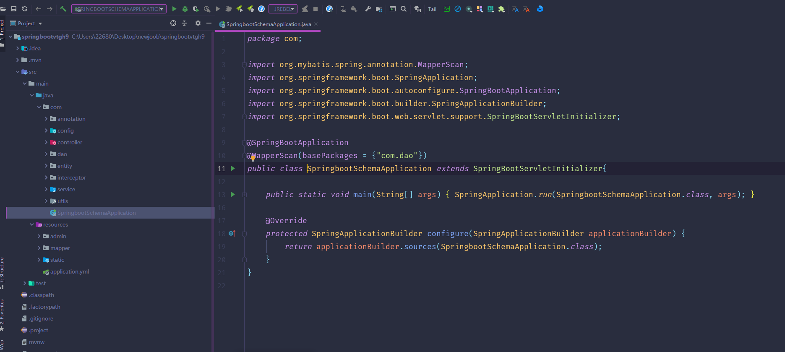
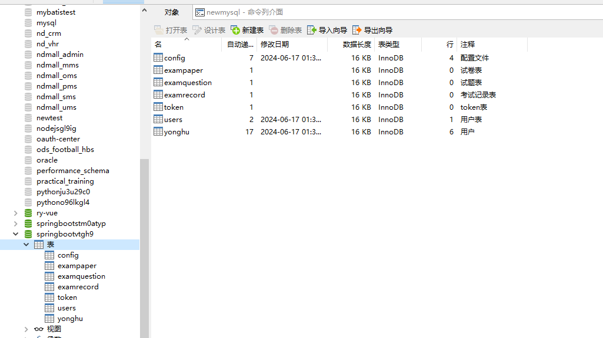
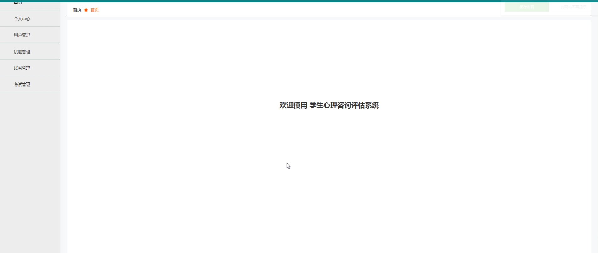
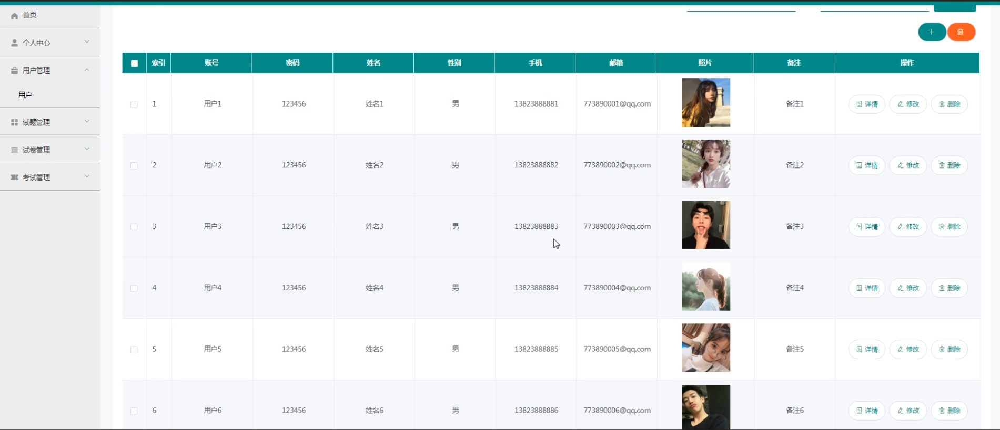
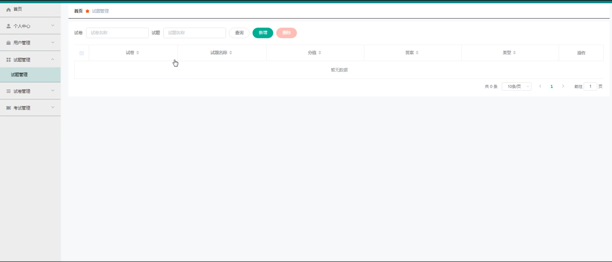
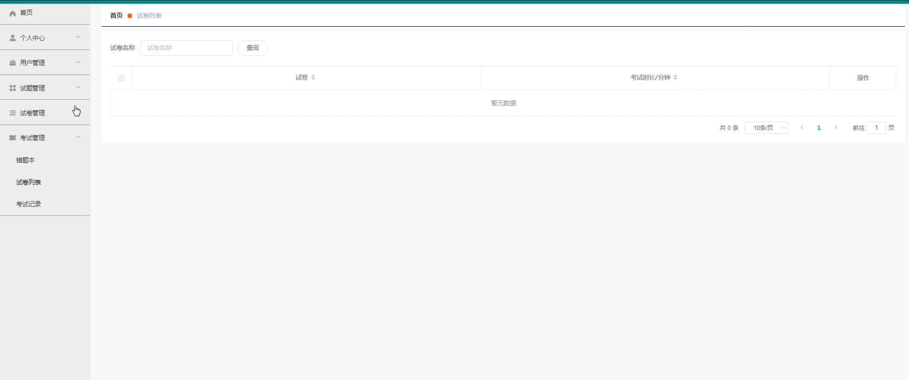
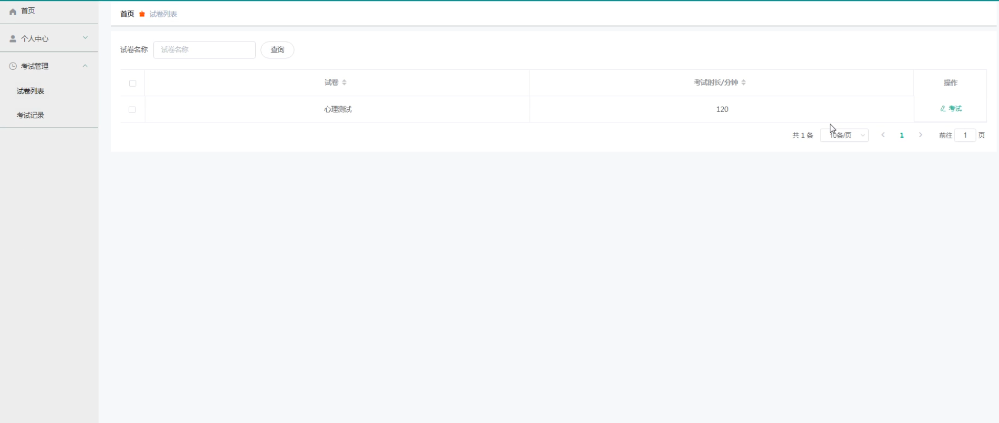
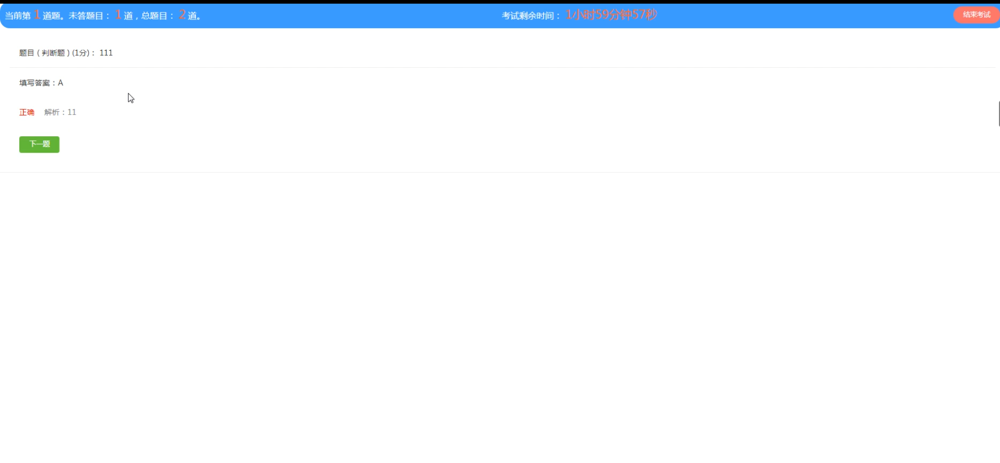

# 学生心理咨询评估系统

#### 介绍
学生心理咨询评估系统是一款集评估、学习与管理于一体的在线平台，它通过科学的评估手段帮助学生深入了解自己的心理状态，并提供个性化的心理咨询建议。该系统功能丰富，操作便捷，为学生提供了全方位的心理支持。

#### 技术栈介绍

后端技术栈：Springboot+Mysql+Maven

前端技术栈：Vue+Html+Css+Javascript+ElementUI

开发工具：Idea+Vscode+Navicate

#### 系统功能介绍

一、管理端功能模块

用户管理：管理员可以添加、编辑、删除用户信息，包括学生、教师等角色。设置用户权限，确保不同角色只能访问其权限范围内的功能。

试题管理：创建、修改和删除心理咨询评估试题。对试题进行分类、标签化管理，便于查找和使用。

试卷管理：管理员可以根据需要组合试题，生成不同难度和主题的试卷。对试卷进行预览、编辑和删除操作。设定试卷的发布时间、有效期等参数。

考试管理：发布试卷给学生进行考试，并设定考试开始和结束时间。监控考试过程，确保考试的公平性和规范性。考试结束后，自动收集和分析考试数据。

错题本：汇总学生的错题信息，形成个性化的错题本。管理员可以查看和分析学生的错题情况，为教学提供参考。

试卷列表：展示所有已发布的试卷列表，包括试卷名称、发布时间、状态等信息。提供搜索和筛选功能，方便管理员快速找到需要的试卷。

考试记录：记录学生的考试历史数据，包括考试时间、成绩、答题情况等。提供数据分析和可视化报告，帮助管理员了解学生的学习情况。

二、用户端功能模块

个人中心：学生可以查看和编辑自己的个人信息，包括姓名、班级、联系方式等。管理自己的账户安全，如密码修改、绑定手机号等。

考试管理：学生可以查看已发布的考试信息，并在规定时间内参加考试。考试过程中，学生可以查看试题、作答并提交试卷。考试结束后，学生可以查看自己的考试成绩和答题情况。

试卷列表：展示所有已发布的试卷列表，学生可以自行选择参加。提供搜索和筛选功能，帮助学生快速找到感兴趣的试卷。

考试记录：记录学生的考试历史数据，学生可以查看自己的考试记录、成绩和答题情况。提供错题回顾功能，帮助学生巩固知识点，提高学习效果。

#### 系统功能截图

代码结构和数据库

登录

首页

用户管理

试题管理

考试管理

试卷列表

考试内容

#### 总结

学生心理咨询评估系统不仅为学生提供了一个了解自己心理状态的窗口，同时也为学校管理者提供了一个高效、便捷的管理工具。通过该系统，学生可以获得个性化的心理咨询建议，学校管理者可以全面了解学生的心理健康状况，为提升整体心理健康水平提供有力支持。

#### 使用说明

创建数据库，执行数据库脚本 修改jdbc数据库连接参数 下载安装maven依赖jar 启动idea中的springboot项目

后台地址：http://localhost:8080/springbootvtgh9/admin/dist/index.html

管理员  abo 密码 abo
